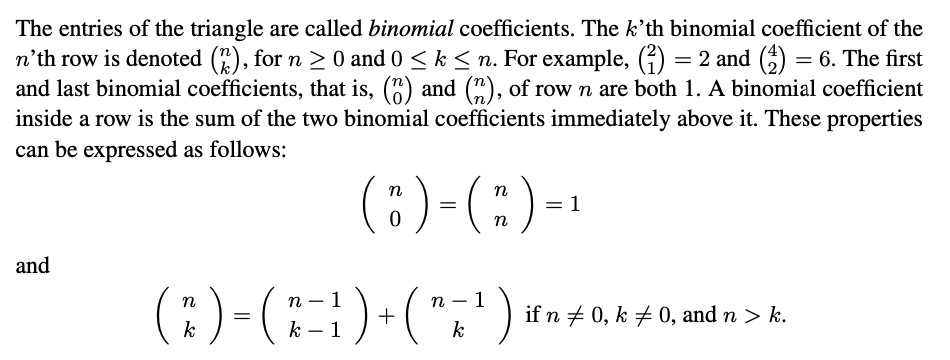

# Homework 02
---
### Exercise 1
Assume the time of day is represented as a pair (hh, mm):int\*int.
Write a function timediff:int\*int->int\*int->int so that timediff t1 t2 computes the difference in minutes between t1 and t2, i.e., t2-t1. A few examples:

```
val timediff : int * int -> int * int -> int
> timediff (12,34) (11,35);;
val it : int = -59
> timediff (12,34) (13,35);;
val it : int = 61
```

### Exercise 2
Write a function minutes:int\*int->int to compute the number of minutes since midnight.
Easily done using the function timediff. A few examples:

```
val minutes : int * int -> int
> minutes (14,24);;
val it : int = 864
> minutes (23,1);;
val it : int = 1381
```

### Exercise 3
Declare an F# function pow: string * int -> string, where:
pow(s,n) = s\*s\*...\*s

### Exercise 4
The following figure gives the first part of Pascal’s triangle:

```
    1
   1 1
  1 2 1
 1 3 3 1
1 4 6 4 1
```



Declare an F# function bin: int \* int -> int to compute binomial coefficients.

### Exercise 5
Consider the declaration:
```
let rec f = function
    | (0,y) -> y
    | (x,y) -> f(x-1, x*y);;
```
1. Determine the type of f
2. For which arguments does the evaluation of f terminate?
3. Write the evaluation steps for f(2,3).
4. What is the mathematical meaning off(x,y)?

```
1. int * int -> int
2. if x = 0      [f(0,_)]
3.
    Step 1: f(2,3) -> f(2-1, 2*3)   [clause 2]
    Step 2: f(1,6) -> f(0, 1*6)     [clause 2]
    Step 3: f(0,6) -> 6             [clause 1]
4. x! * y
```

### Exercise 6
Consider the following declaration:

```
let test(c,e) = if c then e else 0;;
```

1. What is the type of test?
2. What is the result of evaluating test(false,fact(-1))?
3. Compare this with the result of evaluating

```
if false then fact -1 else 0
```

```
// 1. bool * int -> int
// 2. error (StackOverflow)
// 3. if false then fact -1 else 0 always equals 0
```

### Exercise 7
The functions curry and uncurry of types
```
curry   : (’a * ’b -> ’c) -> ’a -> ’b -> ’c
uncurry : (’a -> ’b -> ’c) -> ’a * ’b -> ’c
```

are defined in the following way:  
*curry f* is the function *g* where *g x* is the function *h* where *h y = f(x,y)*.  
*uncurry g* is the function *f* where *f(x,y)* is the value *h y* for the function *h = g x*.  
Write declarations of curry and uncurry.