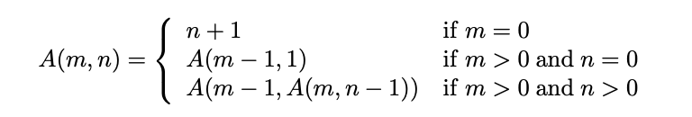

# Homework 04
---
### Exercise 1
Write a function `explode:string->char list`
so that `explode s` returns the list of characters in `s`:

```
explode "star" = [’s’;’t’;’a’;’r’]
```

Hint: if s is a string then `s.ToCharArray()` returns an array of characters. You can then use `List.ofArray`
to turn it into a list of characters.  
Now write a function
`explode2:string->char list`
similar to explode except that you now have to use the string function `s.Chars (or .[])`, where `s` is a string.
You can also make use of `s.Remove(0,1)`. The definition of `explode2` will be recursive.

### Exercise 2
Write a function `implode:char list->string`
so that `implode s` returns the characters concatenated into a string:

```
implode [’a’;’b’;’c’] = "abc"
```

Hint: Use `List.foldBack`.  
Now write a function
`implodeRev:char list->string`
so that `implodeRev s` returns the characters concatenated in reverse order into a string:

```
implodeRev [’a’;’b’;’c’] = "cba"
```

Hint: Use `List.fold`.

### Exercise 3
Write a function `toUpper:string->string`
so that `toUpper s` returns the string `s` with all characters in upper case:

```
toUpper "Hej" = "HEJ"
```

Hint: Use `System.Char.ToUpper` to convert characters to upper case. You can do it in one line using implode, `List.map` and `explode`.  
Write the same function `toUpper1` using forward function composition
`((f >> g) x = g(f x))`.
Write the same function `toUpper2` using the pipe-forward operator `(|>)` and backward function composition
`(<<)`.  
Hint: `<<` is defined as `(f << g) x = (f o g) x = f(g(x))`.  
Hint: `|>` is defined as `x |> f = f x`.  
The two operators are by default supported by F#. You can have F# interactive print the types:

```
> (<<);;
val it : ((’a -> ’b) -> (’c -> ’a) -> ’c -> ’b) = <fun:it@3-4>
> (|>);;
val it : (’a -> (’a -> ’b) -> ’b) = <fun:it@4-5>
> (>>);;
val it : ((’a -> ’b) -> (’b -> ’c) -> ’a -> ’c) = <fun:it@5-6>
```

### Exercise 4
Write a function `palindrome:string->bool`,
so that `palindrome s` returns true if the string `s` is a palindrome; otherwise false.
A string is called a palindrome if it is identical to the reversed string, eg, “Anna” is a palindrome but “Ann” is not.  
The function is not case sensitive.

### Exercise 5
The Ackermann function is a recursive function where both value and number of mutually recursive calls grow rapidly.  
Write the function `ack:int*int->int`
that implements the Ackermann function using pattern matching on the cases of (m,n) as given below.
  
What is the result of `ack(3,11)`.  
Notice: The Ackermann function is defined for non negative numbers only.

### Exercise 6
The function `time f:(unit->’a)->’a*TimeSpan`
below times the computation of f x and returns the result and the real time used for the computation.

```
let time f =
let start = System.DateTime.Now in
let res = f () in
let finish = System.DateTime.Now in
(res, finish - start);
```

Try compute `time (fun () -> ack (3,11))`.  
Write a new function `timeArg1 f a : (’a -> ’b) -> ’a -> ’b * TimeSpan`
that times the computation of evaluating the function `f` with argument `a`. Try `timeArg1 ack (3,11)`.  
Hint: You can use the function `time` above if you hide `f a` in a lambda (function).

### Exercise 7
Declare a function `downto1` such that:

```
downto1 f n e = f(1,f(2,...,f(n−1,f(n,e))...))  for n > 0
downto1 f n e = e   forn ≤ 0
```

Declare the factorial function by use of `downto1`.
Use downto1 to declare a function that builds the list `[g(1), g(2), . . . , g(n)]` for a function `g` and an integer `n`.