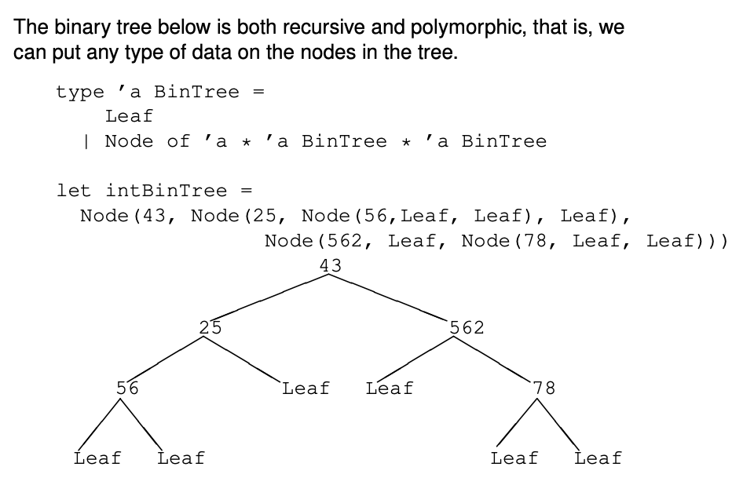

# Homework 05
---
### Exercise 1
Consider the definition of type `’a BinTree` on slide 30.
 
Write a function
`inOrder : ’a BinTree -> ’a list`
that makes an in–order traversal of the tree and collect the elements in a result list. 

>In-order traversal: left sub-tree, node, right sub-tree

With the value `intBinTree`

```
let intBinTree =
Node(43, Node(25, Node(56,Leaf, Leaf), Leaf),
Node(562, Leaf, Node(78, Leaf, Leaf)))
```

we get the following:

```
> inOrder intBinTree;;
val it : int list = [56; 25; 43; 562; 78]
```

### Exercise 2
Write a function
`mapInOrder : (’a -> ’b) -> ’a BinTree -> ’b BinTree`
that makes an in-order traversal of the binary tree and apply the function on all nodes in the tree.  
With the value `intBinTree`

```
let intBinTree =
Node(43, Node(25, Node(56,Leaf, Leaf), Leaf),
Node(562, Leaf, Node(78, Leaf, Leaf)))
```

we can do the following example:

```
> mapInOrder (fun x -> x+1) intBinTree;;
val it : int BinTree =
Node
(44,Node (26,Node (57,Leaf,Leaf),Leaf),
Node (563,Leaf,Node (79,Leaf,Leaf)))
```

Can you give an example of why `mapInOrder` might give a result different from `mapPostOrder`, but the
result tree retruned in both cases is still the same.

### Exercise 3
Write a function
`foldInOrder : (’a -> ’b -> ’b) -> ’b -> ’a BinTree -> ’b`
that makes an in-order traversal of the tree and folds over the elements.  
For instance, given the tree

```
let floatBinTree = Node(43.0,Node(25.0, Node(56.0,Leaf, Leaf), Leaf),
Node(562.0, Leaf, Node(78.0, Leaf,Leaf)))
```

the application
`foldInOrder (fun n a -> a + n) 0.0 floatBinTree`  
returns **764.0**.

### Exercise 4
Complete the program skeleton for the interpreter presented on *slide 28* in the slide deck from the
lecture 5 about finite trees.
The declaration for the abstract syntax for arithmetic expressions follows the grammar *(slide 23)*:

```
type aExp =                 (* Arithmetical expressions *)
    | N of int              (* numbers *)
    | V of string           (* variables *)
    | Add of aExp * aExp    (* addition *)
    | Mul of aExp * aExp    (* multiplication *)
    | Sub of aExp * aExp    (* subtraction *)
```

The declaration of the abstract syntax for boolean expressions is defined as follows *(slide 25)*.

```
type bExp =                 (* Boolean expressions *)
    | TT                    (* true *)
    | FF                    (* false *)
    | Eq of aExp * aExp     (* equality *)
    | Lt of aExp * aExp     (* less than *)
    | Neg of bExp           (* negation *)
    | Con of bExp * bExp    (* conjunction *)
```

The conjunction of two boolean values returns true if both values are true.
The abstract syntax for the statements are defined as below *(slide 26)*:
```
type stm =                      (* statements *)
    | Ass of string * aExp      (* assignment *)
    | Skip
    | Seq of stm * stm          (* sequential composition *)
    | ITE of bExp * stm * stm   (* if-then-else *)
    | While of bExp * stm       (* while *)
```

Define 5 examples and evaluate them.  
For instance, consider the example `stmt0` and initial state `state0` below.

```
let stmt0 = Ass("res",(Add(N 10, N 30)))
let state0 = Map.empty
```

You can then run the example as follows

```
> I stmt0 state0;;
val it : Map<string,int> = map [("res", 40)]
```

and get the result state with variable `res` assigned the value **40** (as expected).

>***TODO*** *define examples*

### Exercise 5
Extend the abstract syntax and the interpreter with if-then and repeat-until statements.

```
let rec I stm s = match stm with
    | Ass(x,a) -> update x ( ... ) s
    | Skip -> ...
    | Seq(stm1, stm2) -> ...
    | ITE(b,stm1,stm2) -> ...
    | While(b, stm) -> ...
    | RU(b, stm) -> ... (* Repeat Until *)
    | IT (b,stm1) -> ... (* If Then *)
```

Again we refer to *slide 28* in the slide deck from the lecture 5.  

*Hint: The if–then statement is similar to the if–then–else statement when you do a Skip statement in the else branch.*  

*Hint: Slide 29 provides an example of running the fac example program with a state mapping x to 4*

### Exercise 6
Suppose that an expression of the form `inc(x)` is added to the abstract syntax. It adds one to the value of `x` in the current state, and the value of the expression is this new value of `x`. The expression `inc(x)` should
be added to the `type aExp`.
How would you refine the interpreter to cope with this construct?
Again we refer to *slide 28* in the slide deck from the lecture 5  

***Hint**: Adding inc(x) to aExp, means that evaluating an expression may also update the state. Hense the state
must be returned which has a rippling effect on the evaluation functions.*

This task is only to describe how you would solve the task. There is no code to hand–in.

>***TODO***